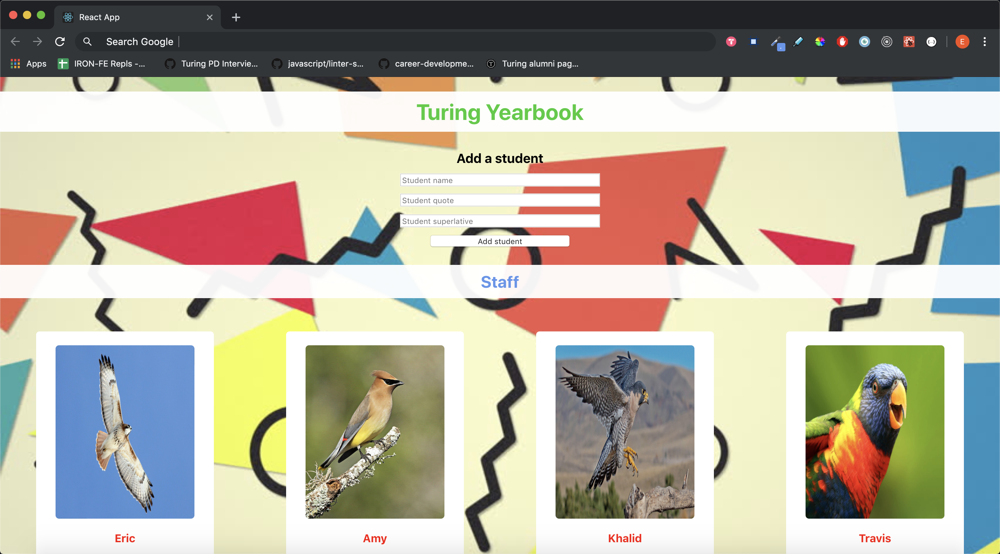
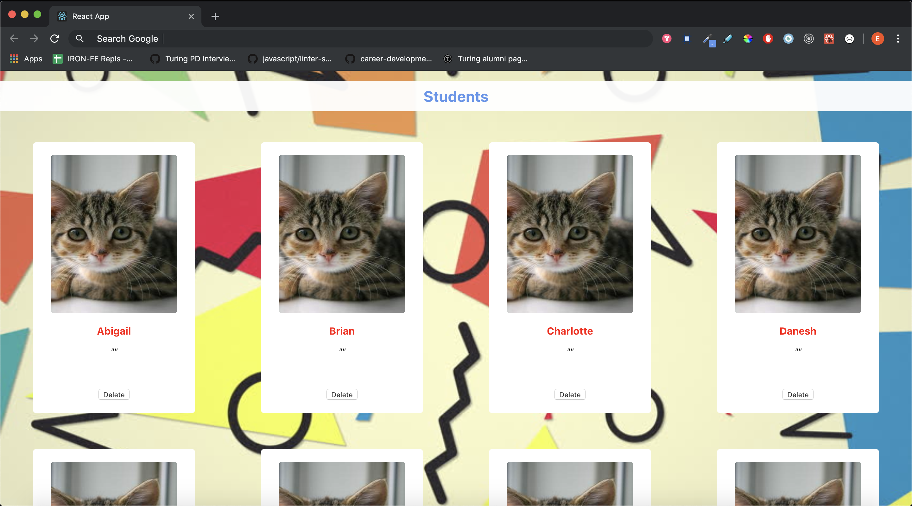

# Turing Yearbook

This is my first attempt at using the React framework. This application is built with two class components (an 'App' class and a controlled form) as well as two functional components.

The goal of this project was to build and test a yearbook-style application that displayed photos, names, quotes, and superlatives of Turing School staff as well as random student mock data. Users can update any name, quote, or superlative.

The controlled form component allows a user to create new students.

## Author

* Eric O'Neill ([eoneill23](https://github.com/eoneill23))

## Setup

1. Clone the repo using `git clone`.
2. Install the dependencies by running `npm install`.
3. Run the test suite with `npm test`.
4. Enjoy!

## Learning goals
* Learn to pass information between components using props.
* Learn to write readable JSX (your render methods/return statements should be clean and simple).
* Use propTypes for every component receiving props.
* Learn how to unit test React components including snapshot testing, methods, and changes in state.

## Objectives

* Get an initial introduction to the React framework.
* Get an initial introduction to testing in React using the Jest testing framework and Enzyme assertion library.
* Utilize both snapshot and unit tests.
* Build out and utilize both class and functional React components.

## Images

